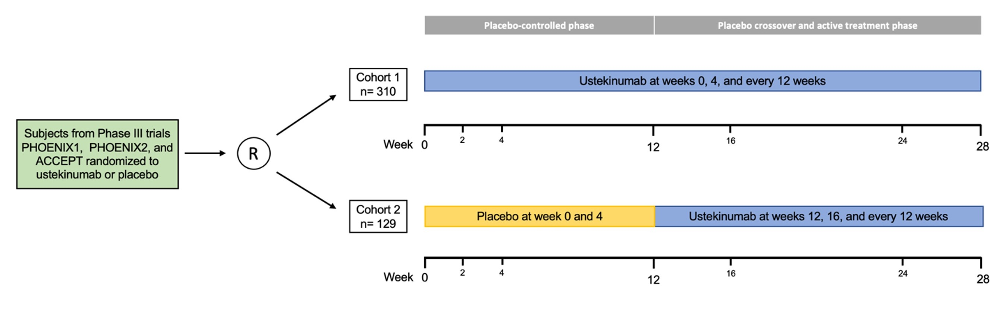

#### Genome-Wide Association Study of Ustekinumab Response in Psoriasis

2022 &#124; *Frontiers in Immunology* &#124; **Connell W.T.**, Hong J., Liao W.

Through GWAS, we identified a novel SNP that is potentially associated with response to ustekinumab in psoriasis.
<!-- 

    

        

        

    

    

 -->

<!-- 

        

            

            

       

 -->