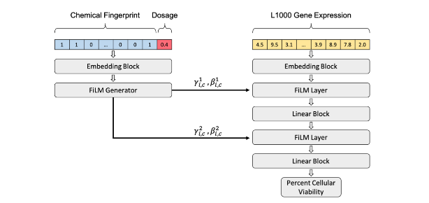

#### Learning chemical sensitivity reveals mechanisms of cellular response

2023 &#124; *bioarxiv* &#124; **Connell W.T.**, Garcia K., Goodarzi H., Keiser M.J. &#124; [Article](https://www.biorxiv.org/content/10.1101/2023.08.26.554851v1){:target="_blank"}

Chemical probes interrogate disease mechanisms at the molecular level by linking genetic changes to observable traits. However, comprehensive chemical screens in diverse biological models are impractical. To address this challenge, we developed ChemProbe, a model that predicts cellular sensitivity to hundreds of molecular probes and drugs by learning to combine transcriptomes and chemical structures. Using ChemProbe, we inferred the chemical sensitivity of cancer cell lines and tumor samples and analyzed how the model makes predictions. ChemProbe is an interpretable in silico screening tool that allows new measurements of cellular response to diverse compounds, facilitating research into molecular mechanisms of chemical sensitivity.

    

        

        

    

    

---

#### A single-cell gene expression language model

2022 &#124; *Learning Meaningful Representations of Life, NeurIPS* &#124; **Connell W.T.**, Khan U., Keiser M.J. &#124; [Article](https://arxiv.org/abs/2210.14330){:target="_blank"}

Given the difficulty of physically mapping mammalian gene circuitry, we require new computational methods to learn gene regulatory rules. Our model, Exceiver, is trained across a diversity of cell types using a self-supervised task formulated for discrete count data, accounting for feature sparsity. Our work provides a framework to model gene regulation on a single-cell level and transfer knowledge to downstream tasks.

    

        

        

    

    

---

#### Genome-Wide Association Study of Ustekinumab Response in Psoriasis

2022 &#124; *Frontiers in Immunology* &#124; **Connell W.T.**, Hong J., Liao W. &#124; [Article](https://www.frontiersin.org/articles/10.3389/fimmu.2021.815121/full){:target="_blank"}

Heterogeneous genetic and environmental factors contribute to the psoriasis phenotype, resulting in a wide range of patient response to targeted therapies. Here, we investigate genetic factors associated with response to the IL-12/23 inhibitor ustekinumab in psoriasis. Through GWAS, we identified a novel SNP that is potentially associated with response to ustekinumab in psoriasis.

    

        

        

    

    

---

#### Nurturing diversity and inclusion in AI in Biomedicine through a virtual summer program for high school students

2022 &#124; *PLOS Computational Biology* &#124; Oskotsky T., Bajaj R., Burchard J., Cavazos T., Chen I., **Connell W.T.**, Eaneff S., Grant T., Kanungo I., Lindquist K., Meyers-Turnbull D., Naing Z.Z.C., Tang A., Vora B., Wang J., Karim I., Swadling C., Yang J., AI4ALL Student Cohort 2020, Lindstaet B., Sirota M. &#124; [Article](https://journals.plos.org/ploscompbiol/article?id=10.1371/journal.pcbi.1009719){:target="_blank"}

Artificial Intelligence (AI) has the power to improve our lives through a wide variety of applications, many of which fall into the healthcare space; however, a lack of diversity is limiting how broadly AI can impact people. This work can guide AI training programs aspiring to engage and educate students entirely online, and motivate people in AI to strive towards increasing diversity and inclusion in this field.

    

        

        

    

    

---

#### Predicting Cellular Drug Sensitivity using Conditional Modulation of Gene Expression

2020 &#124; *Learning Meaningful Representations of Life, NeurIPS* &#124; **Connell W.T.**, Keiser M.J. &#124; [Article](https://www.biorxiv.org/content/10.1101/2021.03.15.435529v1.abstract){:target="_blank"}

Selecting drugs most effective against a tumor’s specific transcriptional signature is an important challenge in precision medicine. To assess oncogenic therapy options, cancer cell lines are dosed with drugs that can differentially impact cellular viability. This ongoing work formalizes in silico cellular screening as a conditional task in precision oncology applications that can improve drug selection for cancer treatment.

    

        

        

    

    

---

#### Helical antimicrobial peptides assemble into protofibril scaffolds that present ordered dsDNA to TLR9

2019 &#124; *Nature Communications* &#124; Lee E., Zhang C., Di Domizio J., Jin F., **Connell W.**, Hung M., Malkoff N., Veksler V., Gilliet M., Ren P., Wong G.C.L. &#124; [Article](https://www.nature.com/articles/s41467-019-08868-w){:target="_blank"}

Amphiphilicity in ɑ-helical antimicrobial peptides (AMPs) is recognized as a signature of potential membrane activity. Some AMPs are also strongly immunomodulatory: LL37-DNA complexes potently amplify Toll-like receptor 9 (TLR9) activation in immune cells and exacerbate autoimmune diseases. The rules governing this proinflammatory activity of AMPs are unknown. Here we examine the supramolecular structures formed between DNA and three prototypical AMPs using small angle X-ray scattering and molecular modeling.

    

        

        

    

    

---

#### A Single-Cell Transcriptomic Atlas of Human Neocortical Development during Mid-gestation

2019 &#124; *Neuron* &#124; Polioudakis D., Torre-Ubieta L., Langerman J., Elkins A.G., Shi X., Stein J.L., Vuong C.K., Nichterwitz S., Gevorgian M., Opland C.K., Lu D., **Connell W.**, Ruzzo E.K., Lowe J.K., Hadzic T., Hinz F.I., Sabri S., Lowry W.E., Gerstein M.B., Plath K., Geschwind D.H. &#124; [Article](https://www.cell.com/neuron/fulltext/S0896-6273(19)30561-6?_returnURL=https%3A%2F%2Flinkinghub.elsevier.com%2Fretrieve%2Fpii%2FS0896627319305616%3Fshowall%3Dtrue){:target="_blank"}

We performed RNA sequencing on 40,000 cells to create a high-resolution single-cell gene expression atlas of developing human cortex, providing the first single-cell characterization of previously uncharacterized cell types, including human subplate neurons, comparisons with bulk tissue, and systematic analyses of technical factors. These data permit deconvolution of regulatory networks connecting regulatory elements and transcriptional drivers to single-cell gene expression programs, significantly extending our understanding of human neurogenesis, cortical evolution, and the cellular basis of neuropsychiatric disease.

    

        

        

    

    

