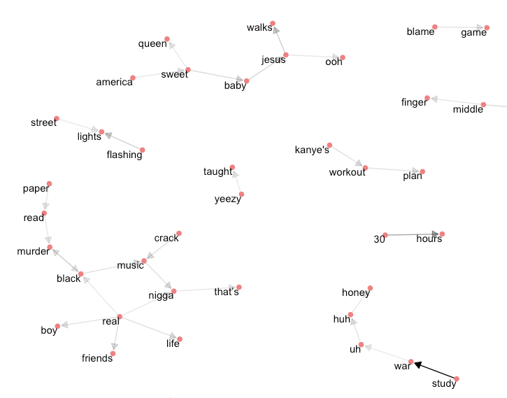

## Introduction
Kanye West is one of the most influential entertainers of the past decade. His creative exploits in music production have overflowed into multiple facets of pop culture - including fashion, social media influence, and publicity stunts. The aggregation of his attention-grabbing work coalesces into an exceptional body of "celebrity engineering" work. Before self-proclaimed deity comparisons fueled by the visibility of celebrity life, "Yeezus" was the pink-poloed, backpack-strapped producer creating platforms for others to  communicate to the public through. So... since 'Ye has picked up the mic, what has he said? Can we tease out the crucial moments in his evolution from "man" to "god" through the emotional sentiment of his lyrics?

### Discography Analysis
One of the first apparent things is that "god" is the 10th most frequently used unique word across all of Kanye's albums. Please consider that "The College Dropout" references "god" in a a much different way than later albums such as "Yeezus". On "I Am a God" Kayne attempts to rectify some humility following self-comparison to the lord on the hook: "I am a god / Even though I am a man of God / My whole life in the hand of God". The size of the each text fragment is scaled to the frequency of use.    

Lets take a look further into the emotions behind Mr. West's lyrics. This is possible by analyzing the positive or negative emotional association of a word with the frequency of it's use. "Shit" and "love" are the top 2 most frequently used words associated with an emotional sentiment. If that doesn't highlight the dichotomous nature of Kanye's personality, I don't know what does. Here are the top 10 most frequently used positive and negative words in Kanye's discography:  

  

### Sentiment Exploration
So are there any interesting positive/negative emotional fluctuations across the chronological development of indiviual albums? Most likely due to the nature of explicit content associated with most rap and hip-hop lyrics, all of the albums have net negative sentiment (nornmalized to the number of songs in each album).  

It is worthwhile to take a closer look at some of the net sentiment ranking of songs across specific albums. The modern internet age of musical artistry has produced a plethora of singles which often lack the narrative qualities associated with the depth of an album. Kanye has his fair share of single releases but they are usually tied to a storyline within an album. Take a look at the sentiment fluctuations within his most recent album, "The Life of Pablo".  

 

### Contextual Analysis
The setiment anlysis is intersting, however it is also very important to also consider the *context* of lyrics. In the previous analysis words are analyzed on an individual basis to inform summarized trends of general sentiment. A more informative approach is to explore the context of words based on word-word associations. For example, if Kanye sings (autotunes?): "Baby **don't worry** about it", the context is positive due to the double-negative sentiment of the ranked words. To look further into how this affects the analysis, check out the relationship between some common negative words and what they are followed by within the lyric.  

  

These "inverse bigrams"" can be thought of as sentimentally ranked in the incorrect orientation. Further investigation reveals that the net sentiment of these incorrectly ranked word-relationships is -66. "No -- no" is probably not contextually positive - it is most likely a repeated pattern. "Never -- fuck" if also probably not a contextually positive term due to the bilateral use of manny swear words. Removing these classifiers reduces the net contribution of inverse bigrams to only -5. We can assume these misclassifications occur at a similar rate within both positive and negative designations, so it is probably not worth the effort to reclassify these inverse bigrams.

### Word Network Visualization
Finally, lets look at a network of bigrams to see how words are related to one another, and the frequency of related use. The directionality of each arrow indicates lyric word order, and the color denisty of each arrow indicates frequency of lyrical use.

This is just a snapshot of a few of the most interesting nodes within the network. A majority of nodes are uninteresting becuase many have word relations based on use in individual songs, and show up within the network because of repeated use (think "30 hours" or "Kanye's new workout plan"). The most interesting grouping to consider is the node which displays the word associations between "black", "real", "music", "nigga", which begs consideration of associated themes within Kanye's music.