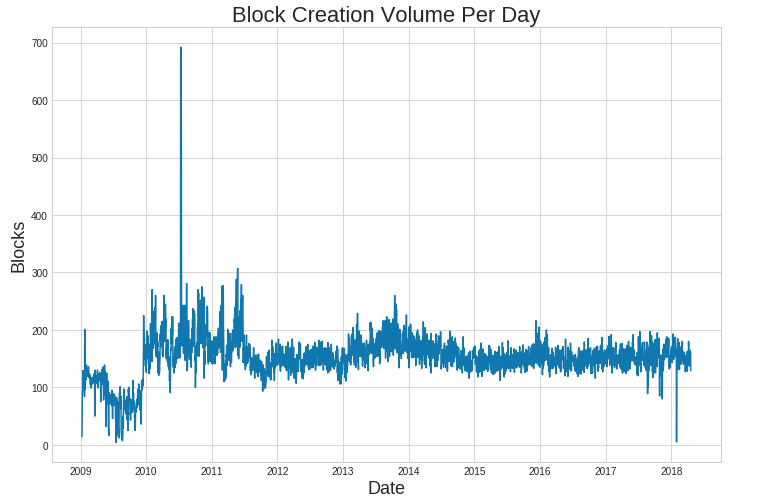
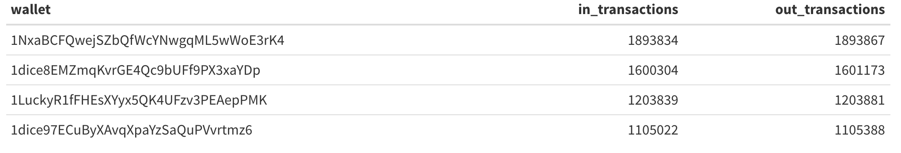
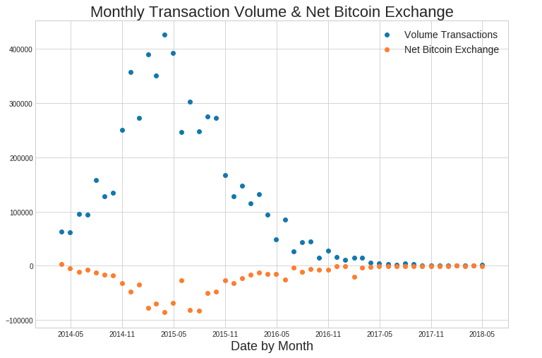
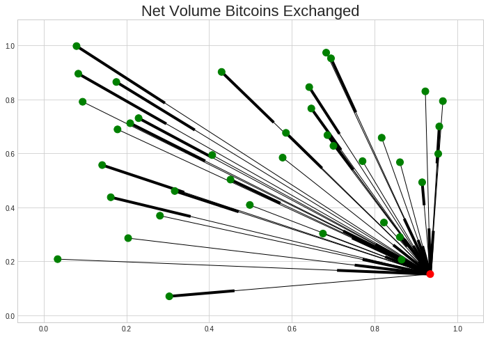
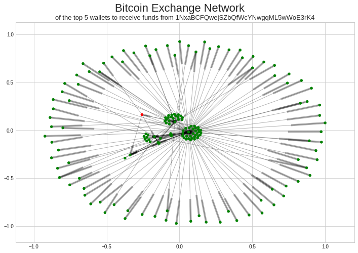
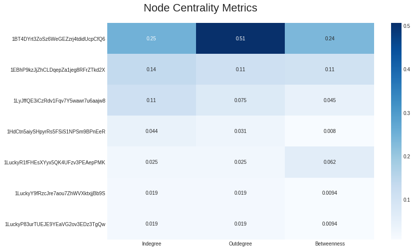

---
layout: post
title:  "Blockchain: Tumbler Network Analysis"
categories: [data,code]
--- 


*This is a repost of a network analysis I performed on historical Bitcoin blockchain data. Kaggle kernels introduced seamless access to this massive raw dataset via Google BigQuery. All of my original code can be found & forked [here](https://www.kaggle.com/slickwilly/network-analysis-bitcoin-blockchain-data/notebook). The code chunks in this post are essential sections that may be helpful for querying via BigQuery in Kaggle kernels and performing network analysis/visualization.*

### Environment

```python
# import libraries into Python 3 env, under kernels docker image
import numpy as np # linear algebra
import pandas as pd # data processing
import networkx as nx # network analysis & viz
import bq_helper # Google BigQuery API helper
import matplotlib.pyplot as plt # plotting libraries
import seaborn as sns
```
Kaggle has put together a useful `bq_helper` package which unpacks SQL object into pandas dataframes. It is immediately available in the kernels docker image.

```python
# create helper object for the  the bigQuery data set
blockchain_helper = bq_helper.BigQueryHelper(active_project="bigquery-public-data",
                                            dataset_name="bitcoin_blockchain")
# to inspect available tables 
blockchain_helper.list_tables()
```
To begin, I performed exploratory data analysis to look at overall historic data trends within the Bitcoin ledger. Below, I define a SQL query and pass it to the BigQueryHelper object to grab the block ID and corresponding block creation timestamp from the database.

```python
# parse the timestamp data into readable date times
query = """ 
      WITH time AS 
      (
          SELECT TIMESTAMP_MILLIS(timestamp) AS trans_time,
              block_id
          FROM `bigquery-public-data.bitcoin_blockchain.blocks`
      )
      SELECT COUNT(block_id) AS blocks,
          EXTRACT(DATE FROM trans_time) AS date
      FROM time
      GROUP BY date
      ORDER BY date
      """
# estimate the query size prior to requesting
blockchain_helper.estimate_query_size(query)
# assign query to dataframe
q1_df = blockchain_helper.query_to_pandas(query)
```

This graph is a visualization of the volume of blocks created each day since the inception of Bitcoin.



Interestingly there is a spike in block creation volume around mid-2010. I did a little bit of research and it turns out July 2010 was an exciting month for Bitcoin. Per [Bitcoin Wiki](https://en.bitcoin.it/wiki/2010#July):

* 07 - Bitcoin v0.3 is released.
* 11 - News of the latest release propagates to Slashdot, causing a large influx of bitcoin users.
* 12 - Bitcoin value begins rising rapidly, going from $0.008 to $0.08 over the next five days.
* 17 - Mt. Gox is established.
* 18 - ArtForz becomes one of the earliest GPU miners.

The huge number of blocks created reflects new user influx into the budding technology, and the new demand resulted in a 10x value increase.


### Transaction Network
A point of interest in this unregulated space is the influence that "whales" (holders of relatively large amounts of currency) have on price fluctuation. Hedge funds, early adopters, governments and businesses (illicit or honest) holding large amounts of Bitcoin can sway value by temporally injecting or withdrawing funds into the market, thereby influencing currency momentum. I looked at the transaction networks of some of these big players to better understand financial behavior in this unregulated space.

I first queried for wallets with the highest volume of tranactions. Below is a query for wallets with the largest volume of buyer-side (in) transactions. A separate but similar query for seller-side (out) transactions revealed virtually the exact same wallets operating at the highest volume. My first idea was these high-frequency wallets may represent financial institutions operating algorithmic trade strategies.

```python
# addresses has the most number of bitcoins sent out
query = """
      SELECT
          inputs.input_pubkey_base58 AS input_key, count(*)
      FROM `bigquery-public-data.bitcoin_blockchain.transactions`
      JOIN UNNEST (inputs) AS inputs
      WHERE inputs.input_pubkey_base58 IS NOT NULL
      GROUP BY inputs.input_pubkey_base58 order by count(*) desc limit 1000
      """
```




Investigating futher, I pulled down all of the data that the wallet with the highest transaction volume was involved in.

```python
# query all transactions this wallet was involved in
q_input = """
        WITH time AS 
            (
                SELECT TIMESTAMP_MILLIS(timestamp) AS trans_time,
                    inputs.input_pubkey_base58 AS input_key,
                    outputs.output_pubkey_base58 AS output_key,
                    outputs.output_satoshis AS satoshis,
                    transaction_id AS trans_id
                FROM `bigquery-public-data.bitcoin_blockchain.transactions`
                    JOIN UNNEST (inputs) AS inputs
                    JOIN UNNEST (outputs) AS outputs
                WHERE inputs.input_pubkey_base58 = '1NxaBCFQwejSZbQfWcYNwgqML5wWoE3rK4'
                    OR outputs.output_pubkey_base58 = '1NxaBCFQwejSZbQfWcYNwgqML5wWoE3rK4'
            )
        SELECT input_key, output_key, satoshis, trans_id,
            EXTRACT(DATE FROM trans_time) AS date
        FROM time
        --ORDER BY date
        """
q3 = blockchain_helper.query_to_pandas(q_input)
# make a datatime type transformation
q3['date'] = pd.to_datetime(q3.date)
q3 = q3.sort_values('date')
# convert satoshis to bitcoin
q3['bitcoin'] = q3['satoshis'].apply(lambda x: float(x/100000000))
# make any sending of bitcoin a negative value representing 'leaving' this wallet
q3['bitcoin_mod'] = q3['bitcoin']
q3.loc[q3['input_key'] == '1NxaBCFQwejSZbQfWcYNwgqML5wWoE3rK4', 'bitcoin_mod'] = -q3['bitcoin_mod']
```

With the preprocessed data, I examined some of the transaction trends. This wallet had a peak of trading activity around May 2015, and the net volume of Bitcoin exchanged was consitently negative. This indicates overall the wallet was trading more Bitcoin away than it was receiving. My initial interpretation of this phenomenom  was the holder was involved in mining activities; this would create an inflow of coins that could be traded away on the currency market.



### Network Analysis
Moving onto network analysis and visualization: below is code to visualize the network of the top 20 wallets the wallet of interest received Bitcoin from, and the top 20 wallets the wallet of interest sent Bitcoin to.

```python
# top 20 wallets bitcoins sent out to
nx_plot_asc = q3.groupby(['input_key', 'output_key'], as_index=False)['bitcoin_mod'].sum().sort_values(by='bitcoin_mod', ascending=True)[0:20]
# top 20 wallets bitcoins received from
nx_plot_desc = q3.groupby(['input_key', 'output_key'], as_index=False)['bitcoin_mod'].sum().sort_values(by='bitcoin_mod', ascending=False)[0:20]
# concatenate
nx_plot = pd.concat([nx_plot_asc, nx_plot_desc], ignore_index=True)
# networkx graph of net volumne of bitcoins transacted (most into and most out of the wallet in question)
G = nx.from_pandas_edgelist(nx_plot, 'input_key', 'output_key', 'bitcoin_mod', nx.DiGraph())
# specify node color
color_list = []
for node in G.nodes():
    if node == '1NxaBCFQwejSZbQfWcYNwgqML5wWoE3rK4':
        color_list.append('red')
    else:
        color_list.append('green')
# plot params
pos=nx.random_layout(G)
nx.draw_networkx_nodes(G,pos, node_list= G.nodes(),node_color='g',node_size=100)
nx.draw_networkx_edges(G, pos)
plt.title('Net Volume Bitcoins Exchanged', fontsize=22)
```

Each node represents a wallet, and the the distance and direction along the edge between each node represents net exchange volume and flow. The closer a node is to any other node, the larger amount of currency transacted between the wallets. The black boxes along each edge can be thought of as arrows, representing the direction of currency travel. This is known as a **trivial graph**, as we are visualizing a graph with a single vertex, <span style="color:red">1NxaBCFQwejSZbQfWcYNwgqML5wWoE3rK4</span>, the wallet of interest.



To investigate a more complex network, I queried the transactions data of the top 5 wallets <span style="color:red">1NxaBCFQwejSZbQfWcYNwgqML5wWoE3rK4</span> sent Bitcoin to. The SQL query code and Python code for graph generation can be found in my original notebook.



A few things come to mind from this visualization, mainly that there are a few nodes which harbor a majority of the transaction flow. The relative "importance"" of vertices in this graph can be computed with different centrality metrics. **Degree centrality** defines "the number of links incident upon a node." Indegree (incoming ties) and outdegree (outgoing ties) centrality help to more specifically define directed networks. **Betweenness centrality** "quantifies the number of times a node acts as a bridge along the shortest path between two other nodes."



The 3 wallets at the top of the chart are all very important in terms of degree centrality, meaning each are connected to many nodes in the network and consequently represent hubs of transaction. 1BT4DYrt3ZoSz6WeGEZzrj4tdidUcpCfQ6 stands out in terms of betweenness centrality, signifying its use as a bridge of connection between nodes. 

The centrality metrics provide an interesting conclusion in regards to the currency dispersion pattern of the original wallet, <span style="color:red">1NxaBCFQwejSZbQfWcYNwgqML5wWoE3rK4</span>. I believe that the most important nodes in this network are most likely wallets under the same ownership, representing central nodes of a currency "cleaning"" service. Due to the unregulated nature of Bitcoin, some individuals use the market to exchange illicit goods and services. To increase anonymity and privacy [cyprtocurrency tumblers](https://en.wikipedia.org/wiki/Cryptocurrency_tumbler) have evolved as a tool to help launder digital currency. From Wikipedia:

> In traditional financial systems, the equivalent would be moving funds through banks located in countries with strict bank secrecy laws, such the Cayman Islands, the Bahamas, or Panama. Tumblers take a percentage transaction fee of the total coins mixed to turn a profit, typically 1-3%. Mixing helps protect privacy and can also be used for money laundering by mixing illegally obtained funds.

By pinging transactions around a network of wallets, these services provide a way for individuals to input 'dirty' Bitcoin and receive 'clean' Bitcoin via creation of a convoluted paper trail.

### Conclusion
Simple network analysis reveals interesting trends within the Bitcoin blockchain ledger, and I have shown an important use case for this type of analysis in detecting sub-networks that may accomodate fraudulent/illicit activity. Using data science in the context of publicly distributed technology will be instrumental in promoting the safe adoption of these amazingly useful exchange platforms. Quantitative insight into blockchain networks can provide developers, as well as legislators, with appropriate information to spur global adoption of this technology.