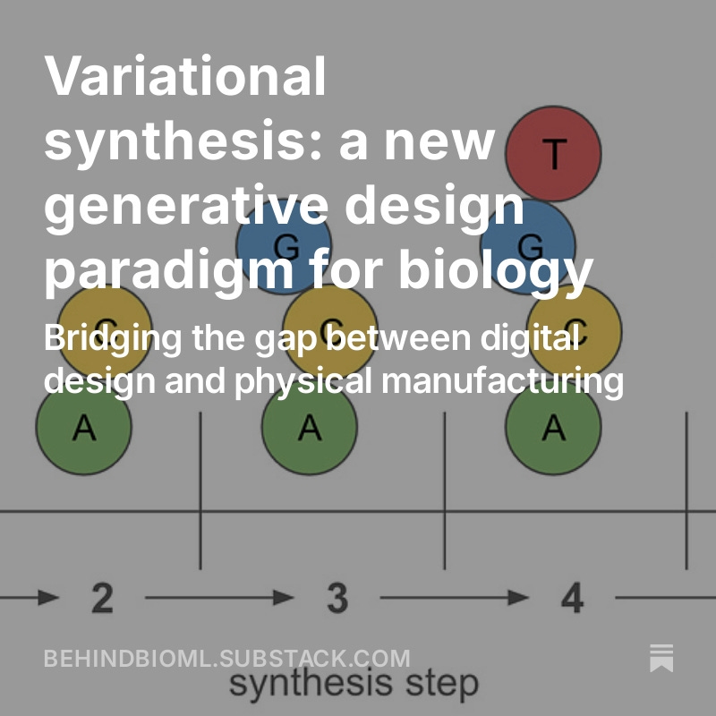

--- 
layout: post
title:  "Variational synthesis: a new generative design paradigm for biology"
categories: [ai,biology]
--- 

*This is a cross post from my Behind BioML substack. Find the original [here](https://open.substack.com/pub/behindbioml/p/variational-synthesis?r=y8mlf&utm_campaign=post&utm_medium=web).*
